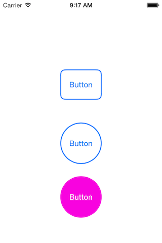
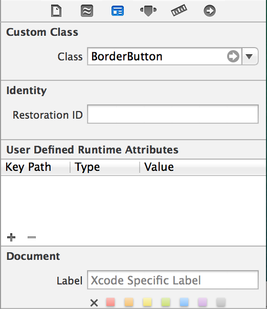

# BorderButton
Subclass of UIButton that gives a colored border around a UIButton. The subclass takes the ```textColor``` attribute and creates a border with that color. When a user presses the button, it will change to be filled with the border color creating a solid color button.



# Basic Usage
To give a button a colored border set the class of the UIButton to ```BorderButton``` in your Storyboard or nib.



If the buttons width and height are equal the class will add a circular border around the buttons frame. If the width and height are not equal, the border will be a rectangle with rounded edges.